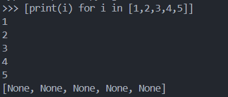

# Inline For Loop

So, usually we use for loop like this

```
i = [1, 2, 3, 4, 5]
for i in i:
    print(i)
```

but, we can write it in more effective way, especially for inline loops

```
[print(i) for i in [1,2,3,4,5]]
```

the output will be

