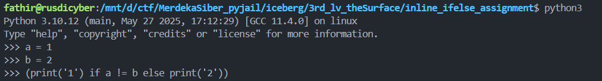

# inline if-else assigments

inline if-else assignment is useful solution to use if-else in pyjail or if u just allowed only type one line.

```
(print('1') if a != b else print('2'))
```

That is the command. This command is more readable than normal if-else assigment. But we need variable before use this command. Just look at image below.

