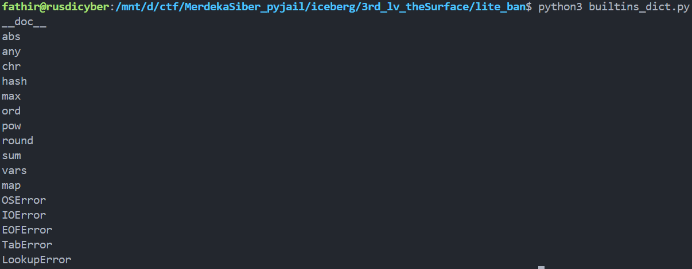
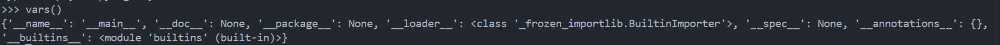
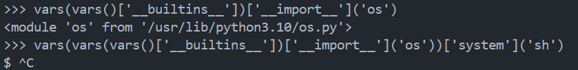

# LITE Ban

LITE Ban is one of banning system in pyjail that we cant use everything that contain "L", "I", "T", and "E".

```
__builtins__.__dict__
```
That is the python command to see the dictionary of builtins function.
So if u can see at image below, we have so many function in __\_\_builtins\_\___.


But, that is too much to read one by one. So i made helper to show what is function that didnt contain __LITE__. This is the <a href='builtins_dict.py'>helper.</a>



If u can see, the function is so little, but one of them is special. __vars()__. So vars is containing builtins function.



And we can call builtins like the image below


next, we need __import os__ and __system sh__ ofc, so we need to wrap the __vars()__ with __vars()__ like the image below



Finally we get the shell. But dont forget about letters LITE ban, so we should change it to another form, i choose to change it using hex string. And im using helper to easlyget the hex in <a href='tohex.py'>this</a>.


btw, u can use another way, like using __input()__, or __chr()__, but it must be long payload yea.