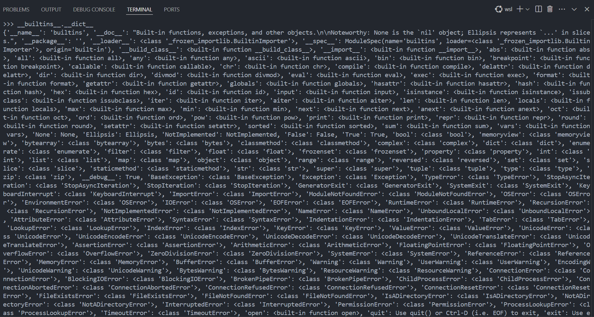

# LITE Ban

LITE Ban is one of banning system in pyjail that we cant use everything that contain "L", "I", "T", and "E".

```
__builtins__.__dict__
```
That is the python command to see the dictionary of builtins function.
So if u can see at image below, we have so many function in __\_\_builtins\_\___.



But, that is too much to read one by one. So i made helper to show what is function that didnt contain __LITE__. This is the helper <a href='builtins_dict.py'></a>