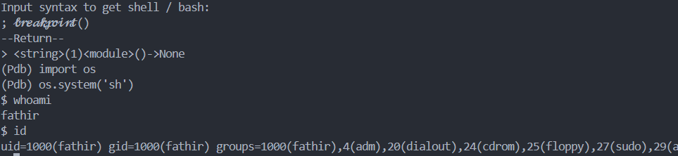
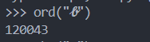
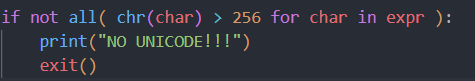

# Unicode

if u can see at __3rd level iceberg__, especially on __golfing 50c__, if it look so hard to shorten the payload, but there is something that mind blowing.


lets try it

```
𝓫𝓻𝓮𝓪𝓴𝓹𝓸𝓲𝓷𝓽()
```



it works!, but this type of payload is always on a blacklist, look at the img below



so, that is the unicode, so we can make the blacklist easily, look



so, we cant use any character that over __256__ in __unicode__