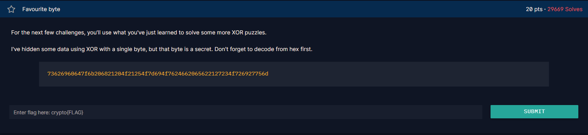

# Chall


## Syntax yang didapatkan

* __bin()__

    syntax bin() digunakan untuk mengubah integer menjadi binary number.

* __[:]__

    [:] syntax ini digunakan untuk __menentukan__ berapa character yang akan diprint atau __menghapus__ berapa character atau huruf yang akan diprint, contoh kasusnya ada dibawah ini.

    Contoh untuk menentukan berapa character yang akan diprint:

    ```
    print("Hello World!"[:2])

    output:

    He

    ```

    Untuk yang lain kurang tau bagaimana, apakah bisa string dengan string, atau string dengan int, lain kali akan aku coba.

    Tapi ketika mencoba untuk xor biasa menggunakan "^", dibawah ini adalah hasilnya.

    ```
    TypeError: unsupported operand type(s) for ^: 'bytes' and 'bytes'
    ```

## Workflow

If u see at the image of the chall, u can see if the chall give the clue itself how the code workflow.

 - KEY1 adalah KEY1 yang didecode dari hex.

 - KEY2 adalah KEY2 yang dioperasikan dengan xor dengan KEY1 yang keduanya telah didecode dari hex.
    - Disini dianggap saja KEY2 sebagai KEY2_1 yang telah dixor dengan KEY1.
    
 - KEY3 adalah KEY2_1 yang dioperasikan dengan xor dengan KEY3 yang keduanya telah didecode dari hex.
    - Disini dianggap saja KEY3 sebagai KEY2_3 yang telah dixor dengan KEY2_1.
    
 - FLAG adalah hasil decode hex dari FLAG ^ KEY1 ^ KEY3 ^ KEY2. Yang dengan kata lain Flagnya terletak pada FLAG yang di-xor dengan KEY1, KEY2_3, dan KEY2_1.