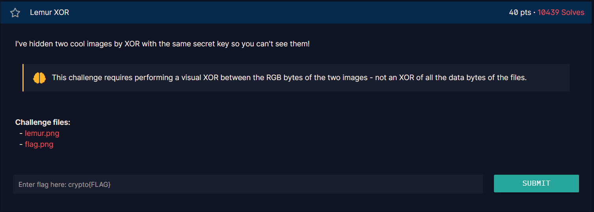

# Chall


## Syntax yang didapatkan

* __from PIL import Image, ImageChops__

    syntax tersebut digunakan untuk memanggil function Image dan ImageChops dari library PIL.

* __Image.Chops.invert()__

    Syntax ini digunakan untuk membalik setiap pixel.

    Contoh:

    ```
    (255, 255, 255) (putih) -> (0, 0, 0) (hitam)
    ```

* __ImageChops.subtract()__

    Syntax ini digunakan untuk mengurangi nilai piksel diantara 2 gambar. Contoh:

    ```
    ImageChops.subtract(i2, i1)
    ```

    maka cara kerjanya kurang lebih akan seperti ini. Contoh:

    ```
    Misalnya: (200, 100, 50) - (100, 100, 50) = (100, 0, 0)
    ```

    Hanya nilai positif yang diambil, dan nilai negatif dianggap 0. Ini berlaku juga pada code berikutnya di file yang sama, yaitu 

    ```
    ImageChops.subtract(i1, i2)
    ```

* __ImageChops.add()__

    Menjumlahkan kedua hasil subtract tadi.


## Workflow

I dont think i need to explain the workflow. Cuz i think its already explained on the top. So, this is my code reference.

 - <a href="lemur1.py">lemur1.py</a> <a href="https://stackoverflow.com/questions/61304857/calculating-xor-of-the-two-images">reference</a>

 - <a href="lemur2.py">lemur2.py</a> <a href="https://crypto.stackexchange.com/questions/88430/how-to-decrypt-two-images-encrypted-using-xor-with-the-same-key">reference</a>   
 