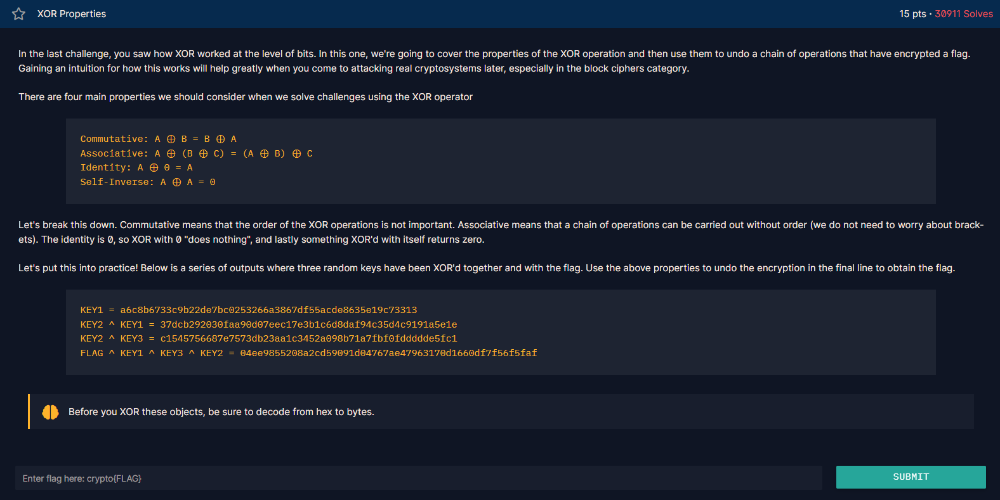

<p>i will update this readme later, mayb with the explanation of the code. </p>

# Chall


## Syntax yang didapatkan

* __from pwn import *__

    Untuk fungsinya disini adalah untuk memanggil semua fungsi yang ada di library pwn, cuma yang akan digunakan disini adalah xor() saja.

* __xor()__

    Ini adalah salah satu function yang ada di library pwn, jadi disini fungsinya adalah untuk melakukan perhitungan xor kepada data type apapun, yang dimana dalam kondisi ini adalah

    ```
    xor(bytes, bytes)
    ```

    Untuk yang lain kurang tau bagaimana, apakah bisa string dengan string, atau string dengan int, lain kali akan aku coba.

    Tapi ketika mencoba untuk xor biasa menggunakan "^", dibawah ini adalah hasilnya.

    ```
    TypeError: unsupported operand type(s) for ^: 'bytes' and 'bytes'
    ```

## Workflow

If u see at the image of the chall, u can see if the chall give the clue itself how the code workflow.

    - KEY1 adalah KEY1 yang didecode dari hex

    - KEY2 adalah KEY2 yang dioperasikan dengan xor dengan KEY1 yang keduanya telah didecode dari hex. (Disini dianggap saja KEY2_1 sebagai KEY2 yang telah dixor dengan KEY1)

    - KEY3 adalah KEY2_1 yang dioperasikan dengan xor dengan KEY3 yang keduanya telah didecode dari hex. (Disini dianggap saja KEY2_3 sebagai KEY3 yang telah dixor dengan KEY2_1)

    - FLAG adalah hasil decode hex dari FLAG ^ KEY1 ^ KEY3 ^ KEY2. Yang dengan kata lain Flagnya terletak pada FLAG yang di-xor dengan KEY1, KEY2_3, dan KEY2_1.