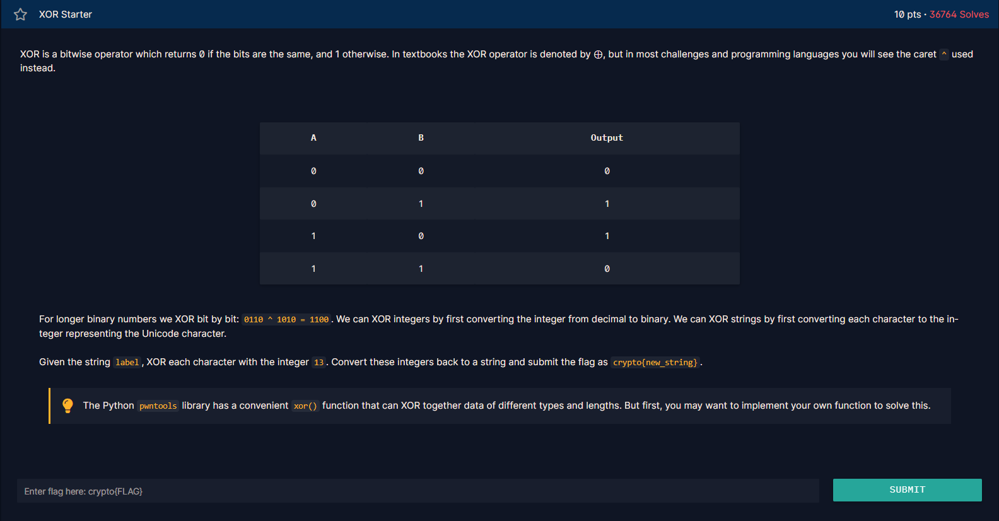

<h1>Chall</h1>

<h2><strong>Syntax yang didapatkan</strong></h2>

<strong>- ^</strong>

^ digunakan untuk melakukan operasi xor, contoh penggunaannya dan cara kerjanya ada di <a href="https://github.com/FTN-Dev/CTF_Learn/blob/main/cryptohack/general/XOR/XOR_Starter/xor.py">sini</a>.

