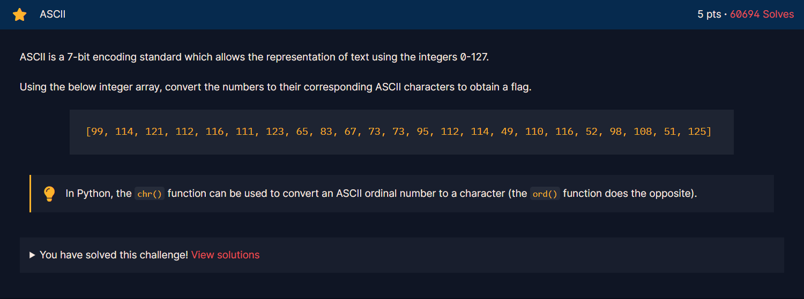

<h1>Chall</h1>

<h2><strong>Syntax yang digunakan</strong></h2>

<strong>- chr()</strong>

chr() digunakan untuk mengubah ASCII numbers menjadi character, untuk caranya bisa dilihat pada <a href="https://github.com/FTN-Dev/CTF_Learn/blob/main/cryptohack/general/encoding/ascii/ascii-chr.py">file ini</a>.

 

<strong>- for index in array(list)</strong>

Loop yang digunakan untuk mengambil setiap index dari dalam array atau list.

 

<strong>- ' '.join</strong>

''.join digunakan untuk string yang terletak pada list atau array menjadi satu string yang sama (sejajar). Contohnya bisa dilihat pada <a href="https://github.com/FTN-Dev/CTF_Learn/blob/main/cryptohack/general/encoding/ascii/ascii-chr.py">file ini</a>.

 

<strong>- ord(array)</strong>

Digunakan untuk mengubah variable yang berisi list atau array yang isinya adalah string, untuk diubah menjadi ASCII numbers. Contohnya bisa dilihat <a href="https://github.com/FTN-Dev/CTF_Learn/blob/main/cryptohack/general/encoding/ascii/ascii-ord.py">disini</a>.

 

<strong>- list(var_string)</strong>

list(var_string) digunakan untuk mengubah strings dipisah menjadi index index yang ada pada array atau list. Contohnya bisa dilihat <a href="https://github.com/FTN-Dev/CTF_Learn/blob/main/cryptohack/general/encoding/ascii/ascii-ord.py">disini</a>.

 

<strong>- var_array.append(var_isi)</strong>

var_array.append(var_isi) digunakan untuk mengisi suatu variable yang berisi tipe data (strings, int, dll) untuk dimasukkan di akhir list. Contohnya bisa dilihat <a href="https://github.com/FTN-Dev/CTF_Learn/blob/main/cryptohack/general/encoding/ascii/ascii-ord.py">disini</a>.
