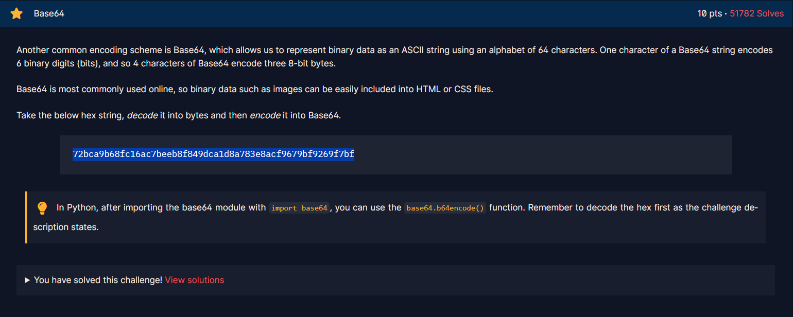

<h1>Chall</h1>

<h2><strong>Syntax yang didapatkan</strong></h2>

<strong>- import base64</strong>

import base64 digunakan untuk mengambil module module yang ada di library base64.

<strong>- base64.b64encode(variable)</strong>

base64.b64encode(variable) digunakan untuk melakukan encode dari byte menjadi base64.

<strong>- base64.b64encode(variable_plaintext.encode('utf-8'))</strong>

base64.b64encode(variable_plaintext.encode('utf-8')) digunakan untuk encode plaintext atau strings ke base64.

<strong>- base64.b64decode(variable_ciphertext.encode('utf-8'))</strong>

base64.b64decode(variable_ciphertext.encode('utf-8')) digunakan untuk decode ciphertext atau encoded(b64) strings ke plaintext atau text biasa.
