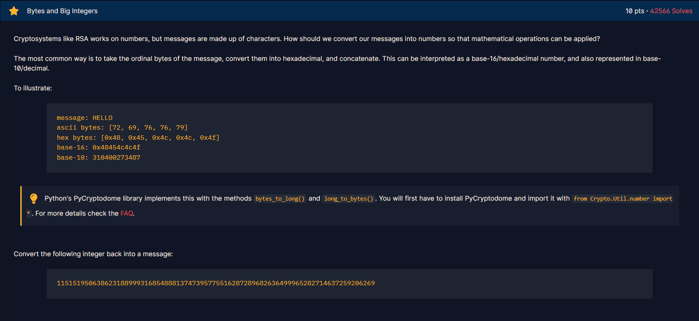

<h1>Chall</h1>

<h2><strong>Syntax yang didapatkan</strong></h2>

<strong>- from Cryptodome.Util.number import *</strong>

from Cryptodome.Util.number import * digunakan untuk mengambil semua function yang ada di library Cryptodome.Util.number, contoh long_to_bytes.

 

<strong>- long_to_bytes</strong>

long_to_bytes digunakan untuk mengubah big integer menjadi bytes.

 

<strong>- bytes_to_long</strong>

bytes_to_long digunakan untuk mengubah bytes menjadi big integer.
