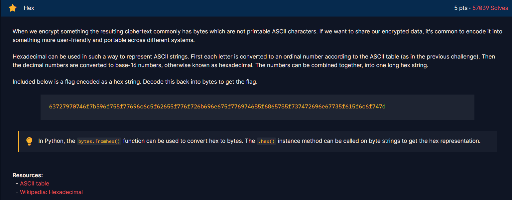

<h1>Chall</h1>

<h2><strong>Syntax yang didapatkan</strong></h2>

<strong>- bytes.fromhex()</strong>

         bytes.fromhex() digunakan untuk mengubah hex text kembali menjadi plaintext

<strong>- bytes.hex()</strong>

         bytes.hex() digunakan untuk mengubah plaintext menjadi hex

